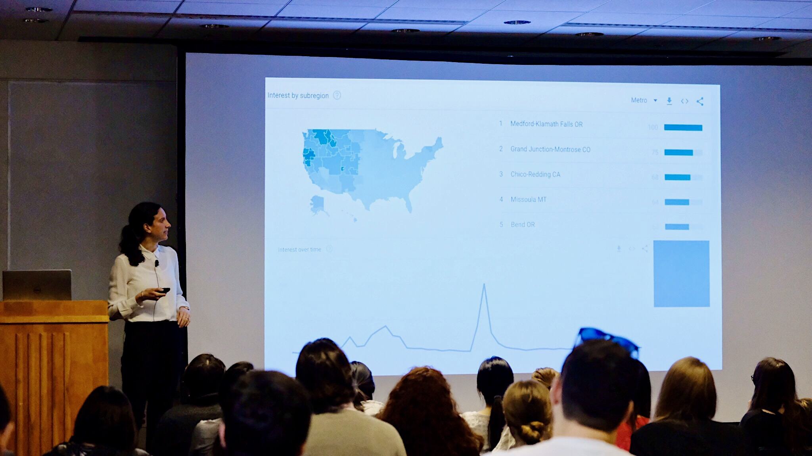
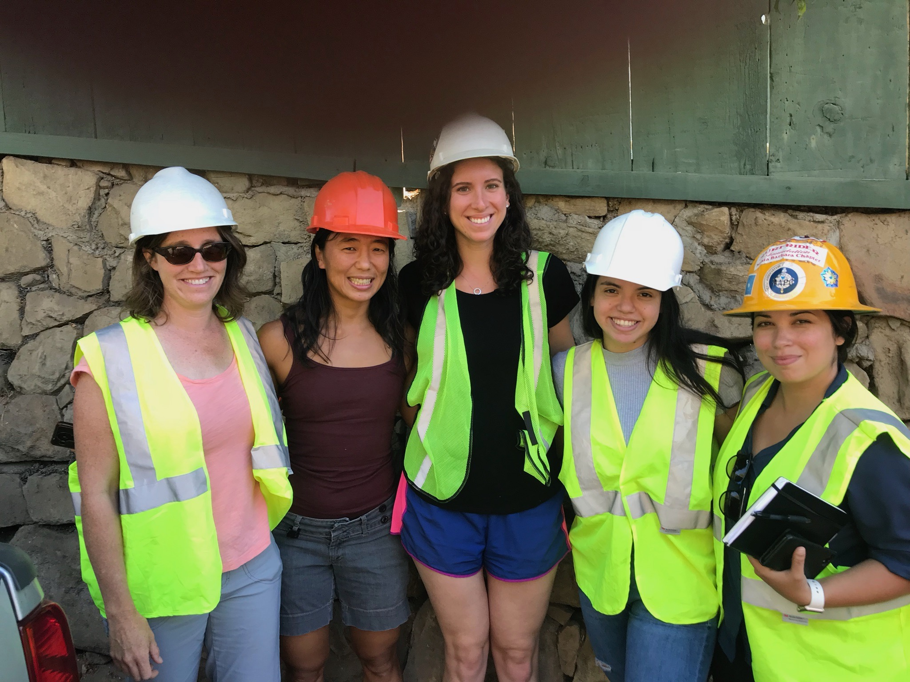
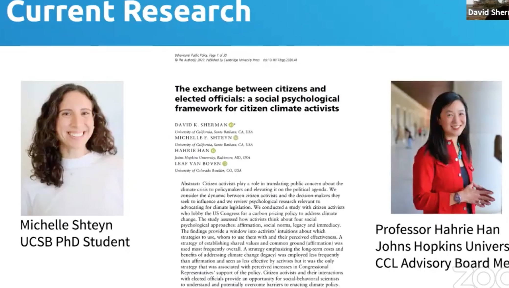

```{r setup, include=FALSE}
knitr::opts_chunk$set(echo = FALSE)
```
# My Research
  In my psychological research, I study the ways that having personal, concrete experiences with climate change (such as extreme weather) influence people's climate change beliefs, pro-environmental policy support, and sustainable behavior. I have investigated this question through a series of ongoing projects using a variety of methods. These methods include analyzing extreme weather search patterns on [Google Trends](https://trends.google.com/trends/?geo=US), conducting a survey with a large online sample selected to be representative of the U.S. population on key demographics, conducting a field experiment in Montecito, California post-debris flows, and conducting a field experiment with [citizen climate lobbyists](https://citizensclimatelobby.org/) in Washington, D.C.
  
  I have presented peer reviewed work to a diverse audience of research scientists and academics at four conference presentations.
  
### Presenting findings at UC Santa Barbara:
U.S. regional Google search activity for extreme weather terms on Google Trends predicts U.S. regional climate change beliefs on Yale Climate Opinion Maps (Marlon et al., 2020). Presentation at Psychological & Brain Science Department's "Minicon," Winter 2019.



### Research Team at Montecito, CA Debris Flow Site:



### Communicating Findings to Activists at Citizens' Climate Lobby 
As part of Dr. David Sherman's presentation to climate activists on actionable insights from Sherman, Shteyn, Han, and Van Boven (2020).



